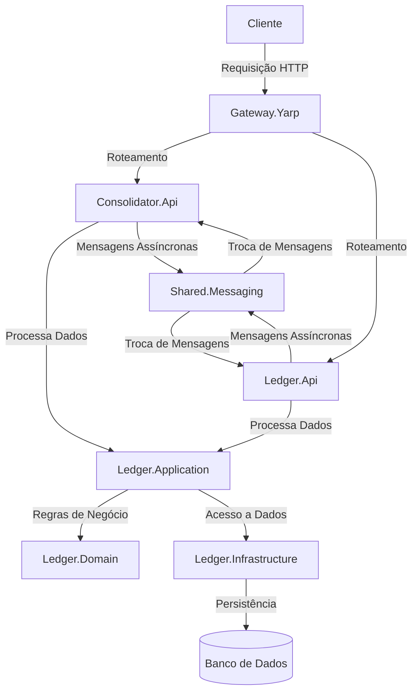

# Desafio de Arquiteto – Controle de Lançamentos e Consolidado Diário

Este repositório apresenta uma solução completa para o desafio de arquitetura descrito no documento fornecido. O objetivo é construir uma aplicação escalável e resiliente para controlar lançamentos (créditos e débitos) de uma lanchonete e gerar um saldo diário consolidado. A solução foi pensada para ser executada em **Linux (Ubuntu/WSL)** com **Docker** e **Docker Compose**, facilitando a subida local e a avaliação.

## Visão geral

O documento do desafio exige dois serviços principais: um para registrar os lançamentos de débito/crédito e outro para consolidar o saldo diário. Além disso, há requisitos não‑funcionais importantes, como garantir que o serviço de lançamentos continue disponível caso o de consolidação falhe e suportar picos de **50 requisições por segundo** com no máximo **5 % de perda**【926386920860220†L83-L87】. A proposta atende a esses requisitos através de uma arquitetura orientada a eventos (EDA) com comunicação assíncrona via **RabbitMQ**, persistência em **PostgreSQL**, cache em **Redis** e APIs construídas com **ASP.NET Core 8 Minimal APIs**.

### Componentes principais

- **Ledger Service (`Ledger.Api`)** – expõe endpoints HTTP para criar e consultar lançamentos. Persiste dados no PostgreSQL e grava eventos no padrão **Outbox** para publicação assíncrona. Utiliza o padrão **CQRS** com **MediatR** para separar comandos/consultas.
- **Consolidator Service (`Consolidator.Api`)** – consome eventos de lançamentos via **MassTransit/RabbitMQ**, calcula saldos diários por comerciante e armazena no banco. Exibe o saldo diário via endpoint HTTP e utiliza **Redis** para cache.
- **Messaging Contracts (`Shared.Messaging`)** – define contratos de eventos compartilhados entre os serviços.
- **Gateway (opcional)** – um proxy reverso baseado em **YARP** que unifica as chamadas às APIs. Pode ser evoluído para uso de **Apigee** no futuro.
- **Docker Compose** – orquestra todos os serviços e dependências (PostgreSQL, RabbitMQ, Redis, serviços .NET e gateway).
- **Makefile** – oferece comandos simplificados para build, testes, subida e descida do ambiente.
- **Scripts de testes** – inclui teste de carga `k6` para verificar que o consolidado suporta 50 req/s com perda ≤ 5 %, conforme o requisito【926386920860220†L83-L87】.

## Arquitetura

### Comunicação e Resiliência

Os serviços se comunicam de forma assíncrona por meio do broker **RabbitMQ**. O **Ledger Service** grava os eventos em uma tabela **Outbox** junto com o lançamento. Um **worker** de publicação lê a tabela periodicamente e envia as mensagens para o broker. Caso o **Consolidator Service** fique fora do ar, os eventos permanecem na tabela até que ele esteja disponível, garantindo que o serviço de lançamentos continue funcionando, conforme o requisito de não interromper o fluxo de caixa quando o consolidado cair【926386920860220†L83-L87】.

No **Consolidator Service**, um consumidor de eventos (MassTransit) agrega os lançamentos por data e comerciante, calcula o saldo total e persiste em uma tabela `DailyBalances`. Para melhorar a performance de leitura, os saldos são armazenados em **Redis** com tempo de expiração configurável.

### Padrões de Design

* **Minimal APIs**: usamos **ASP.NET Core 8 Minimal APIs** para definir endpoints de forma enxuta, reduzindo boilerplate e facilitando testes.
* **Domain‑Driven Design (DDD)**: os modelos de domínio (Entidades, Repositórios) ficam em projetos separados, isolando regras de negócio.
* **CQRS com MediatR**: comandos (escritas) e consultas (leituras) são tratados separadamente, aumentando a coesão e facilitando testes.
* **Outbox Pattern**: garante a consistência entre a gravação no banco e a publicação de eventos, evitando perda de mensagens quando a fila está indisponível.
* **Event‑Driven Architecture (EDA)**: os serviços são desacoplados por eventos, possibilitando escalabilidade e resiliência.

## Execução local

1. **Pré‑requisitos**: ter **Docker** e **Docker Compose** instalados em seu ambiente Linux/WSL.
2. Clone este repositório: `git clone <url>`
3. Execute `make up` para construir as imagens e subir todos os serviços em segundo plano.
4. Acesse:
   - Ledger API: `http://localhost:5000`
   - Consolidator API: `http://localhost:5001`
   - RabbitMQ Management: `http://localhost:15672` (usuário/ senha: `guest/guest`)
   - Redis: `localhost:6379`
5. Para derrubar os serviços, execute `make down`.

### Endpoints principais

**Ledger Service**:

* `POST /entries` – cria um lançamento. Exemplo de payload:

  ```json
  {
    "merchantId": "lojadoze",
    "amount": 25.50,
    "type": "Credit"
  }
  ```

* `GET /entries/{id}` – consulta um lançamento por ID.

**Consolidator Service**:

* `GET /daily-balances?date=2025-09-30` – obtém o saldo diário consolidado (por dia e por comerciante).

## Estrutura do projeto

```
.
├── README.md
├── Makefile
├── docker-compose.yml
├── k6
│   └── load_test.js
└── src
    ├── Shared.Messaging
    │   ├── Shared.Messaging.csproj
    │   └── Events
    │       └── EntryRecorded.cs
    ├── Ledger.Domain
    │   ├── Ledger.Domain.csproj
    │   └── Entities
    │       ├── EntryType.cs
    │       └── LedgerEntry.cs
    ├── Ledger.Infrastructure
    │   ├── Ledger.Infrastructure.csproj
    │   ├── LedgerDbContext.cs
    │   ├── OutboxMessage.cs
    │   ├── Repositories
    │   │   └── LedgerRepository.cs
    │   └── Services
    │       └── OutboxWorker.cs
    ├── Ledger.Application
    │   ├── Ledger.Application.csproj
    │   └── Commands
    │   │   ├── CreateEntryCommand.cs
    │   │   └── CreateEntryCommandHandler.cs
    │   └── Queries
    │       ├── GetEntryByIdQuery.cs
    │       └── GetEntryByIdQueryHandler.cs
    ├── Ledger.Api
    │   ├── Ledger.Api.csproj
    │   ├── Program.cs
    │   └── Dockerfile
    ├── Consolidator.Api
    │   ├── Consolidator.Api.csproj
    │   ├── Program.cs
    │   ├── ConsolidatorDbContext.cs
    │   ├── Entities
    │   │   └── DailyBalance.cs
    │   ├── Consumers
    │   │   └── EntryRecordedConsumer.cs
    │   └── Dockerfile
    └── Gateway.Yarp (opcional)
        ├── Gateway.Yarp.csproj
        ├── Program.cs
        ├── appsettings.json
        └── Dockerfile
```

## Evoluções futuras

Embora a solução atual atenda aos requisitos, diversas evoluções podem ser implementadas:

- **Testes mais abrangentes**: adicionar testes de integração com **Testcontainers** e testes E2E com **Playwright**.
- **Configuração de CI/CD**: Este projeto pode ser integrado com pipelines de CI/CD para automação de build e deploy. Certifique-se de configurar o pipeline de acordo com as necessidades do seu ambiente.
- **Observabilidade**: a implementação inclui configuração de **OpenTelemetry** para traces e métricas. Em ambientes produtivos, podemos exportar para ferramentas como Prometheus/Grafana ou Azure Application Insights.
- **Gateway e API Management**: a camada de gateway (`Gateway.Yarp`) pode ser integrada a uma plataforma de API Management como **Apigee** para controle de quotas, monetização e publicação externa.

Sinta‑se à vontade para contribuir, sugerir melhorias ou relatar problemas. Esperamos que esta solução ajude a demonstrar sua capacidade de tomar decisões arquiteturais sólidas e atender aos requisitos de um ambiente corporativo moderno.

# Desafio Solution

## Visão Geral

Este projeto é uma solução modular baseada em .NET, composta por várias camadas e serviços. Ele utiliza uma arquitetura limpa para organizar responsabilidades e garantir escalabilidade e manutenibilidade. Além disso, o projeto suporta execução em contêineres via Docker e inclui testes automatizados e de carga.

---

## Estrutura do Projeto

Abaixo está a definição de cada camada e suas responsabilidades:

### **Camadas**

#### 1. **Consolidator.Api**
- **Responsabilidade**: Fornece uma API para consolidar dados de diferentes fontes. Atua como um serviço intermediário que processa e organiza informações antes de enviá-las para outras camadas.
- **Fluxo de Dados**: Recebe dados de serviços externos ou de outras APIs internas, processa e envia para o `Ledger`.

#### 2. **Gateway.Yarp**
- **Responsabilidade**: Implementa um gateway de API utilizando o YARP (Yet Another Reverse Proxy). Gerencia o roteamento de requisições para os serviços internos.
- **Fluxo de Dados**: Recebe requisições externas e as encaminha para os serviços apropriados, como `Consolidator.Api` ou `Ledger.Api`.

#### 3. **Ledger.Api**
- **Responsabilidade**: Exponibiliza endpoints para gerenciar e consultar informações financeiras.
- **Fluxo de Dados**: Interage com as camadas de aplicação, domínio e infraestrutura para realizar operações de leitura e escrita.

#### 4. **Ledger.Application**
- **Responsabilidade**: Contém a lógica de aplicação, incluindo casos de uso e validações. Atua como intermediária entre a API e o domínio.
- **Fluxo de Dados**: Recebe comandos da API, aplica regras de negócio e interage com o domínio.

#### 5. **Ledger.Domain**
- **Responsabilidade**: Define as entidades, agregados e regras de negócio fundamentais. É a camada central da arquitetura.
- **Fluxo de Dados**: Não depende de outras camadas. É consumida pela camada de aplicação.

#### 6. **Ledger.Infrastructure**
- **Responsabilidade**: Implementa a persistência de dados e integrações externas (ex.: bancos de dados, filas de mensagens).
- **Fluxo de Dados**: Fornece acesso aos dados para as camadas superiores.

#### 7. **Shared.Messaging**
- **Responsabilidade**: Contém abstrações e implementações para comunicação assíncrona entre serviços (ex.: mensagens em filas ou tópicos).
- **Fluxo de Dados**: Facilita a troca de mensagens entre serviços como `Consolidator.Api` e `Ledger.Api`.

---

## Fluxo de Dados

1. **Requisição Externa**: O cliente faz uma requisição para o `Gateway.Yarp`.
2. **Roteamento**: O `Gateway.Yarp` roteia a requisição para o serviço apropriado (ex.: `Consolidator.Api` ou `Ledger.Api`).
3. **Processamento**:
   - A API correspondente processa a requisição e interage com a camada de aplicação.
   - A camada de aplicação aplica regras de negócio e interage com o domínio.
   - O domínio realiza operações e, se necessário, interage com a infraestrutura para persistência ou recuperação de dados.
4. **Resposta**: A resposta é enviada de volta ao cliente via `Gateway.Yarp`.

---

## Passo a Passo para Execução

### **1. Pré-requisitos**
- .NET SDK 6.0 ou superior instalado.
- Docker e Docker Compose instalados.
- Node.js instalado (para executar testes de carga com K6).
- K6 instalado. Para instalar o K6, execute o comando abaixo:
  ```sh
  npm install -g k6
  ```

### **2. Restaurar Dependências**
Execute o comando abaixo para restaurar os pacotes NuGet:
```sh
dotnet restore
```

### **3. Construir o Projeto**
Para compilar o projeto, execute:
```sh
dotnet build
```

### **4. Executar o Projeto**
Para executar o projeto localmente, utilize o Docker Compose:
```sh
docker-compose up --build
```

Os serviços estarão disponíveis nas seguintes portas:
- **Gateway.Yarp**: `http://localhost:500`
- **Consolidator.Api**: `http://localhost:5001`
- **Ledger.Api**: `http://localhost:5002`

### **5. Executar Testes Automatizados**
Para rodar os testes unitários e de integração, execute:
```sh
dotnet test
```

### **6. Executar Testes de Carga**
Os testes de carga estão localizados na pasta `k6/`. Para executá-los, utilize o comando:
```sh
k6 run k6/load_test.js
```

---

## Estrutura de Pastas

```plaintext
src/
├── Consolidator.Api/       # API de consolidação de dados
├── Gateway.Yarp/           # Gateway de API com YARP
├── Ledger.Api/             # API para gerenciamento financeiro
├── Ledger.Application/     # Lógica de aplicação
├── Ledger.Domain/          # Entidades e regras de negócio
├── Ledger.Infrastructure/  # Persistência e integrações externas
├── Shared.Messaging/       # Comunicação assíncrona entre serviços
k6/                         # Scripts de teste de carga
```

---

## Contribuição

1. Faça um fork do repositório.
2. Crie uma branch para sua feature/bugfix:
   ```sh
   git checkout -b minha-feature
   ```
3. Faça commit das suas alterações:
   ```sh
   git commit -m "Descrição da alteração"
   ```
4. Envie suas alterações:
   ```sh
   git push origin minha-feature
   ```
5. Abra um Pull Request.

---

## Licença

Este projeto está licenciado sob os termos da [MIT License](LICENSE).

## Fluxo da Arquitetura

Abaixo está um diagrama que exemplifica o fluxo completo da arquitetura do projeto:



### Explicação do Gráfico
1. **Cliente**: Representa o usuário ou sistema externo que faz requisições para a aplicação.
2. **Gateway.Yarp**: Atua como um roteador, direcionando as requisições para os serviços apropriados.
3. **Consolidator.Api** e **Ledger.Api**: São os serviços principais que processam as requisições.
4. **Ledger.Application**: Contém a lógica de aplicação e interage com o domínio e a infraestrutura.
5. **Ledger.Domain**: Define as regras de negócio e entidades principais.
6. **Ledger.Infrastructure**: Gerencia a persistência e integrações externas.
7. **Banco de Dados**: Armazena os dados persistentes da aplicação.
8. **Shared.Messaging**: Facilita a comunicação assíncrona entre os serviços.